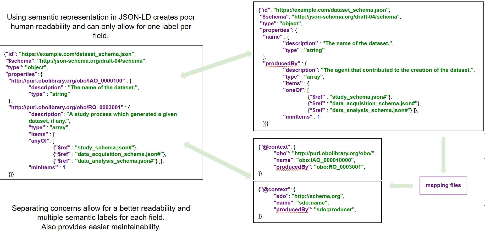
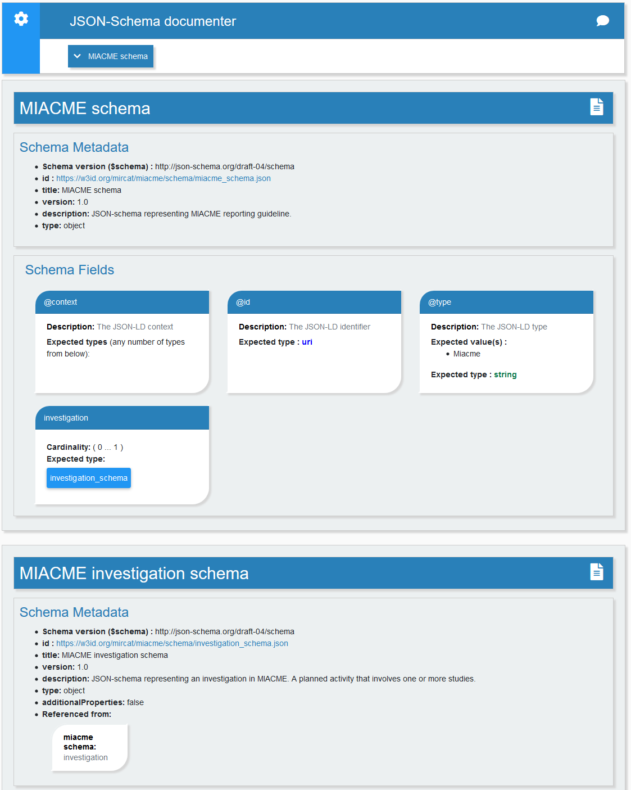
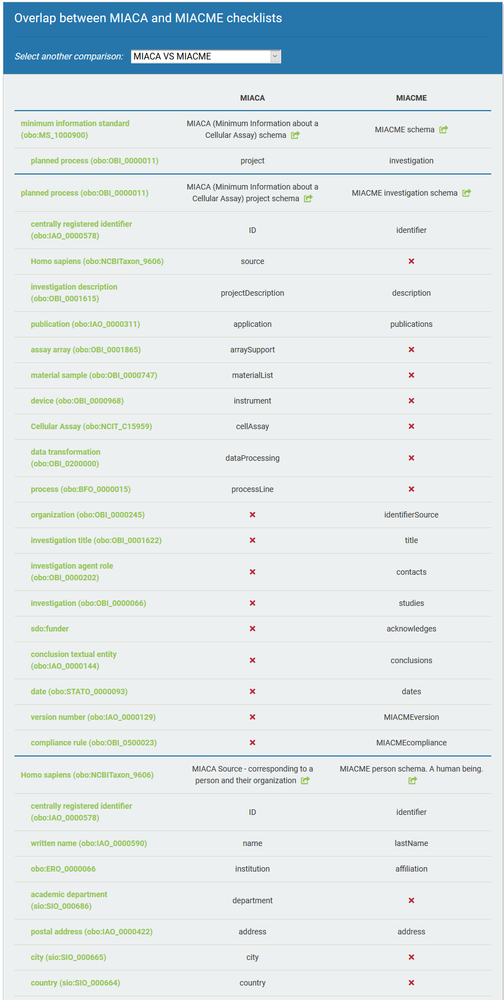
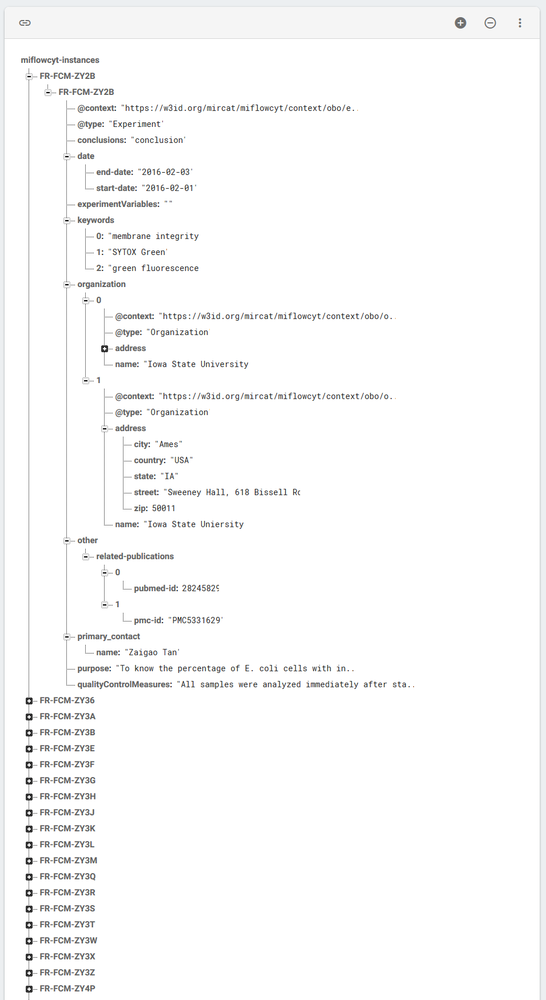

[](https://travis-ci.org/FAIRsharing/jsonldschema)
[](https://coveralls.io/github/FAIRsharing/jsonldschema?branch=master)
[](https://jsonldschema.readthedocs.io/en/latest/?badge=latest)


## Machine Actionable Metadata Models
One of the most common format to exchange data over the web is the **JavaScript Object Notation** (**JSON**). It is a popular open-standard that can be used to represent data instances but also to represent 
and physical constraints a given object should comply with. These syntactic constraints are called **JSON schemas**.

The **JSON-Schema** specification informs about the the properties of an object. Among those, one may find names, 
descriptions, values, cardinality and so on.
<br/> The specification provides a powerful mechanism (the ```$ref``` keyword) to create links between schemas called references. An easy to understand example is the relationship between an Organization and a Person through 
the ```employee``` property. In some rare cases, an employee could also be another organization or even both at the 
 same time (a single self-employed person hired as a service provider through his own company). JSON-Schema also supports these types of relationships through the use of the ```anyOf```, ```oneOf``` and ```allOf``` keywords.
<br/> These references give the ability to create very complex oriented graphs (possibly cyclic ones, see [below](#optional-identify-circularity-in-schemas)) where each
vertices is a _schema_ and each edge a _relationship between two schemas_. In this documentation we will refer to these interconnected structures
 as **networks**.

Networks allow to represent very dense sets of objects which may become hardly human readable when the numbers of properties and relationships
reaches certain thresholds.
<br/>Adding to the complexity, some semantic constrains should also be taken into consideration for machine readability.. This extra layer creates an even more complex specification to deal with.

#### Separating syntactic and semantic layers:


In order to cope with both the semantic and syntactic concerns, the semantic layer was separated from the schemas and included in context files following the **JSON-LD** specification. Each schema is bound to a set of context 
files (through mapping files) that deliver the ontology term identifiers for each of the schemas properties. 
<br/> This allows to easily reuse or extend existing schemas or networks with new vocabulary terms and to have different mappings to ontologies 
living side by side, for different purposes and different communities.

This repository provides a python3 toolkit that helps users create, compare, merge and explore schemas and their associated context files. It thus provides the means to 
increase the existing pool of **machine** and **human readable models** that describe the **syntactic** and **semantic constrains** of an object **metadata**.
<br/> This is an essential functionality, in the context of data **Findability**, **Accessibility**, **Integrability** and **Reusablity** ([FAIR](https://www.nature.com/articles/sdata201618)) 
especially when considering the representation of minimal information checklists, which are often textual artefacts, lacking machine readability. 


#### Inputs
The tested input networks required to create the toolkit are the following:
- Minimum Information About Cell Assays: **[MIACA](https://github.com/FAIRsharing/mircat/tree/master/miaca)** 
- Minimum Information About Cell Migration Experiments: **[MIACME](https://github.com/FAIRsharing/mircat/tree/master/miacme)**
- Data Tag Suite: **DATS** [schemas](https://github.com/datatagsuite/schema) and [context](https://github.com/datatagsuite/context)
- Minimum Information About Flow Cytometry Experiments: **[MiFlowCyt](https://github.com/FAIRsharing/mircat/tree/master/miflowcyt)**


#### Navigation

1) [Setting up](#setting-up)
2) [Explore existing schemas in the browser](#exploring-an-existing-set-of-schemas) (requires the jsonschema documenter)
3) [Compare schemas in the browser](#compare-schemas) (requires the compare-and-view tool)
4) [Merge schemas](#merge-schemas)
5) [Create new context files or extend existing ones](#create-new-context-files)
6) [Import MiFlowCyt instances](#import-and-validate-miflowcyt-dataset) (dataset) as JSON-LD and validate them against the proper schema set (requires an API key)
7) [Identify circularity in existing set of schemas](#optional-identify-circularity-in-schemas) (using yet another python library)
8) [License](#license)
9) [Contact](#contact)


## Setting Up:

First, you will need to set up a virtual environment, then import the code and install dependencies:
```
virtualenv venv
source venv/bin/activate
git clone https://github.com/FAIRsharing/jsonldschema.git
cd jsonldschema
pip install -r requirements.txt
```

If you plan on using either the CEDAR exporter or the MiFlowCyt importer, you will also need to provide your API keys through 
a configuration file and, optionally run the integration tests.
- make a copy of the ```/tests/test_config.json.sample``` file and open the copy:

```bash
cp /tests/test_config.json.sample /tests/test_config.json
```

You will need to provide:
- your staging and production CEDAR API keys (include the key string in the corresponding attribute)
- an existing and valid CEDAR folder ID on which you can read/write content on the production server
- an existing and valid CEDAR template ID on which you can read/write content on the production server
- a valid user ID which will become the author of created content (UUID on your CEDAR user profile page, https://cedar.metadatacenter.org/profile)
- a valid [Flow Repository](https://flowrepository.org/) API key.

Integration tests are located under ```/tests/integration```. They rely on API calls and are therefore excluded from the continuous integration builds.


## Exploring an existing set of schemas:

### Use-cases
When you extend or explore set of schemas, whether you are a community trying to create their own specifications, or a data producer trying to comply with a model,
you need to understand the information that is being represented. This usually means a lot of navigation between the interconnected schemas
and context files within a network. 
<br/>For instance, understanding the knowledge of a single property involves opening the corresponding schema file, locating the field and identifying its optional references to other structures. 
You also need to locate the corresponding context files, open them, locate the term and search for it's ontology identifier in a lookup service. And you need to repeat that process for each field of each reference within that field,
and, optionally, for each vocabulary system you need to deal with.
<br/> We have written a javascript client side application, the [JSON-Schema Documenter](https://github.com/FAIRsharing/JSONschema-documenter), that does all that for you and 
display the fully resolved network directly in the browser.

The Documenter will allow you to:
- explore the detailed properties of each schema;
- verify that each field is correctly tagged with a resolvable ontology term identifier (e.g.: the ```name``` field of a ```Person``` object is labelled with ```http://purl.obolibrary.org/obo/IAO_0000590``` 
which resolves to ```written name```) and, thus, the correctness of your context files;
- identify and navigate through the bi-directional relationships between the different schemas;
- identify reusable components created by other communities so you don't have to reinvent the wheel.


### Usage
If your schemas are living remotely and are accessible through a URL, you can use the [online tool](https://fairsharing.github.io/JSONschema-documenter/) directly by providing your main 
schema URL as a parameter to the tool URL. To do that, add ```?schema_url=yourURL``` at the end of the tool.
<br/> For instance, to view the MIACA network the URL would be ```https://fairsharing.github.io/JSONschema-documenter?schema_url=https://w3id.org/mircat/miacme/schema/miacme_schema.json```

If you also want to add the semantic constrains pulled from the associated context files, you will have to provide a mapping file containing these references that can be generated 
for you using the ```schema2context.generate_context_mapping()``` class method (see [documentation](https://jsonldschema.readthedocs.io/en/latest/utils/schemaUtilities.html#schema2context.generate_context_mapping)). 
You can then upload that mapping file (on github for instance) and provide its URL  as another parameter to the documenter. 
<br/> For MIACA, we would have the following ```https://fairsharing.github.io/JSONschema-documenter/?schema_url=https://w3id.org/mircat/miacme/schema/miacme_schema.json&context_mapping_url=https://w3id.org/mircat/miacme/schema_context_mapping.json```.

If the schemas are living locally only (which is usually the case during development), you can clone the JSON-Schema documenter repository and, optionally,
put it under a web server (such as Apache, Nginx, ...). It will then behave the same way the online service does but can resolve local networks.
<br/>For instance, if the application is deserved through port 8000, your url would be:
 ```localhost:8000/JSONschema-documenter?schema_url=path/to/main/schema.json&context_mapping_url=path/to/context/mapping/file.json```
<br/> We recommend using the ```schemas/``` directory at the root of the application for that purpose.

#### Screenshots of the MIACA network loaded in the jsonschema online documenter:



## Compare schemas

### Use-cases
Comparing schemas can be particularly useful if you intend on creating **metadata that comply with several models** or to **identify
overlaps with existing networks** when creating or extending set of schemas.
<br/> The key point to understand before comparing schemas or networks is that the comparisons are solely based on ontology labels found
in context files. This implies that:
1) Fields and objects without semantic values will never match anything and will be ignored. To verify if all fields are correctly tagged with an ontology term, 
see above [Exploring an existing set of schemas](#exploring-an-existing-set-of-schemas).
2) Syntactic constrains are ignored when comparing: only the semantic constrains are being considered.
3) Comparisons should be ran within the same contexts: using a schema.org on the one hand, versus a obo markup on the other, will very likely lead to no results.

The python tool will assist you into running the comparison process which will generate an output file containing the comparison results. However, 
to visualize the results, you will need to use a second javascript application, the [compare-and-view](https://github.com/FAIRsharing/JSONschema-compare-and-view) tool.
<br/> A particularity of this tool is that it relies on the Ontology Lookup Service ([OLS](https://www.ebi.ac.uk/ols/index)) API to resolve the machine readable identifiers into human readable strings. For instance
```NCBITaxon_9606``` is also shown as ```homo sapiens``` when displaying the ```source``` of a ```planned process``` in the context of MIACA and MIACME (see figure [below](#screenshots-of-the-miaca-network-loaded-in-the-jsonschema-online-documenter)).
<br/> This is key to understand the definition held by each property. The property names that can be found in the schemas are human readable representations and do not carry the meaning of the property. That meaning is resolved
using the ontology identifiers found in the context files. Thus, properties with the same name might not represent the same thing and properties with different names can actually mean the same thing. For instance, both MIACA and MIACME have a 
```planned process``` representation that have different names (```project``` for MIACA and ```investigation``` for MIACME).
<br/> This is the main reason why the comparison align schemas and properties based on the ontology terms and not on the object names.


### Usage
In order to run a comparison between two networks you will have to use the ```FullDiffGenerator``` or  ```FullSemDiff```classes (see [documentation](https://jsonldschema.readthedocs.io/en/latest/semDiff/semDiffIndex.html))
based on your use case. Optionally, you can also run a schema comparison with the ```EntityCoverage``` class 
(see [documentation](https://jsonldschema.readthedocs.io/en/latest/semDiff/semanticComparator.html))
if you are working on a specific schema and don't want to resolve the full networks.
<br> The comparison process is not very intensive but may require to resolve all schemas in the two given networks. This process 
can be long depending on the number and size of the schemas and the properties of the server delivering them.


#### Screenshots of the comparison display between MIACA and MIACME



## Merge schemas

### Use-cases
Merging is the logical extension of the comparison functions. It will help you **import properties** and **schemas** from one network to another without
manually processing each single item or without creating references to external networks out of you control and thus can change at any point in time.
<br/> Manual processing can be very easy if the schema you need to reuse is simple and do not have any reference. Just copy paste the schema file and its context files.
If it does though, you will be required to either remove these references or copy all nested children and their context.
<br/> You may want to let the code do that for you in that case.

The way the merge is implemented relies on the output of the comparison. If two schemas are labelled with the same ontology identifier
they can be merged. The algorithm will pull all fields and their references from the second schema and recursively add them to the first if they are 
not already there. If will also change all names and identifiers as required.
<br/> The most important consequence is that the merge order will have a high impact on the final output: merging B into A or A into B will not generate
the same result.
 
The combination of the comparison and merge functions make a very good tool to verify your output. Running a first comparison, merging and running secondary comparison with the two merge input allows to verify 
the integrity of the output and that it matches the desired result.

### Usage
Coming up soon, please refer to documentation.

If you are creating a network and wish to import a schema you need to create the base file but stripped of property fields and add it to your network through the corresponding reference.
 Identify the ontology term that this object will be labelled with (it need to be the same as the schema you want to import) 
 and add it to the corresponding context file. When running the merge, the object, its references and their respective context files will be
 added to the output.
 <br/> Note: the input is never modified, a third network is created for you instead.

## Create new context files

### Use-cases
These functionality are extremely important to **allow different communities** that agreed on syntactic constrains **to use different ontology** (thus, semantic constrains). This enables, for instance, to have
```dcat```, ```schema.org``` and ```obo``` markups describing the same schemas. 
<br/> This is also key when one wants to comply with the syntactic constrains of a schema
but can't use or disagree with the proposed ontology terms. Rather than creating a new network from scratch or importing the existing one, an easier and more reusable solution is to extend the existing one.
<br /> The code will assist you into creating the context files, pre-populated with the desired ontology prefixes and URL, and the corresponding mapping files.
<br> Unfortunately, without extensive AI, the code cannot guess ontology terms. Thus, you will have to find the ontology terms and identifiers yourself and manually add them
to the corresponding field in the corresponding context files that have been created for you.

### Usage
Coming up soon, please refer to documentation.


## Import and validate MiFlowCyt dataset

### Use-cases
This code will not be relevant to developers or data providers trying to create their own set of schemas. It purpose is to showcase how the code works and the functionality that can be used.

Using the JSON-Documenter, the comparator and the context file assistance, the Minimum Information About Flow Cytometry Experiments checklist was expressed in JSON-Schemas and tagged with ontology terms from obo foundry.
<br/> The code in the module is a client implementation of the Flow Repository API which deliver MiFlowCyt dataset through XML format.
<br/> The XML data is progressively transformed to a simple JSON into which are injected the properties required by the JSON-LD specifications.
<br/> The data is then syntactically validated against the corresponding MiFlowCyt schemas and, if valid, pushed to a FireBase real-time database (see picture [below](#valid-miflowcyt-json-ld-instance-extracted-and-transformed-from-flow-repository)).

#### Valid MiFlowCyt JSON-LD instance extracted and transformed from Flow Repository and added to a FireBase real-time database:


### Usage
Coming up soon, please refer to documentation.


## (Optional) Identify circularity in schemas

### Use-cases
Some networks and schemas, due to the ability to reference each others, can have a lot of circularity. On top of being harder to navigate through for human beings,
it can also create algorithmic bugs including endless loops, recursive caps, ... In very rare cases, it's even 
possible to use this technique to crash a target host by triggering an uncaught endless loop.
<br/> This code will simply identify circularity between schemas in a network and return them as an array by using First Depth Search.

### Usage
Coming up soon, please refer to [JSON-Cycles](https://github.com/FAIRsharing/jsonCycles).


## License
This code is provided under [BSD 3-Clause License](https://github.com/FAIRsharing/jsonldschema/blob/master/LICENSE.md)

## Contact

- [Dominique Batista](http://github.com/terazus)


