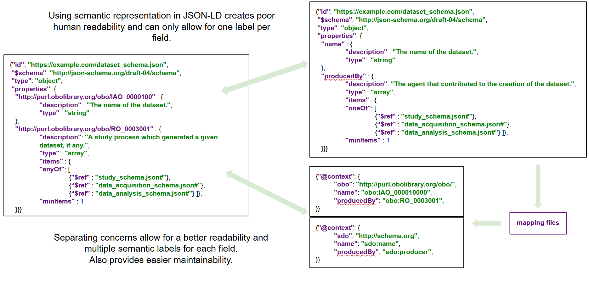

[](https://travis-ci.org/FAIRsharing/jsonldschema)
[](https://coveralls.io/github/FAIRsharing/jsonldschema?branch=master)
[](https://jsonldschema.readthedocs.io/en/latest/?badge=latest)


## Introduction

This project is about creating human and machine readable models representing metadata semantic and syntactic shapes and providing a toolkit to help users deal with these schemas.
In order to create these representations we chose one of the most common format used for exchanging data over the web: the JavaScript Object Notation (JSON).

The JSON-Schema specification is an easy way to inform about the syntactic constrains an object is subject to, but becomes hardly readable by human when represented with 
semantic identifiers. In order to cope with this, the semantic constrains were separated from the syntactic ones by using context files inspired by the JSON-LD specification. 
This separation of concerns has been greatly helpful to create a machine and human readable system for representing syntactic and semantic constrains.

#### Separating syntactic and semantic layers:


The purpose of building these representation is to allow for machine to automatically understand, assess and validates items 
given a semantics and syntactics constrains while still providing human friendly supports.
This is very important, especially in the context of data Findability, Accessibility, Integrability and Reusablity (FAIR) 
where a lot of representations are still too verbose and lack machine readable formats. 

The input used to create the toolkit can be found as follow:
- Minimum Information About Cell Assays: [MIACA](https://github.com/FAIRsharing/mircat/tree/master/miaca) 
- Minimum Information About Cell Migration Experiments: [MIACME](https://github.com/FAIRsharing/mircat/tree/master/miacme)
- Data Tag Suite: DATS [schemas](https://github.com/datatagsuite/schema) and [context](https://github.com/datatagsuite/context)
- Minimum Information About Flow Cytometry Experiments: [MiFlowCyt](https://github.com/FAIRsharing/mircat/tree/master/miflowcyt)

This repository offers code to help users deal with these complexes schemas. It also output particular variables that can we represented in the browser 
using two separate javascript libraries that are presented below.

1) Setting up
1) Explore existing schemas in the browser (requires the jsonschema documenter)
2) Compare schemas in the browser (requires the compare-and-view tool)
3) Merge schemas
4) Create new context files or extend existing ones
5) Export schemas in the CEDAR application
6) Import MiFlowCyt instances (dataset) as JSON-LD and validate them against the proper schema set (requires an API key)
7) Identify circularity in existing set of schemas (using yet another python library)


## Setting Up:

First, you will need a virtual environment, import the code and install dependencies:
```
virtualenv venv
source venv/bin/activate
git clone https://github.com/FAIRsharing/jsonldschema.git
cd jsonldschema
pip install -r requirements.txt
```

If you plan on using either the CEDAR exporter or the MiFlowCyt importer, you will need to provide your API keys through 
a configuration file and, optionally run the integration tests.
- make a copy of the ```/tests/test_config.json.sample``` file and open the copy:

```bash
cp /tests/test_config.json.sample /tests/test_config.json
```

You will need to provide:
- your staging and production CEDAR API keys (include the key string in the corresponding attribute)
- an existing and valid CEDAR folder ID on which you can read/write content on the production server
- an existing and valid CEDAR template ID on which you can read/write content on the production server
- a valid user ID which will become the author of created content (UUID on your CEDAR user profile page, https://cedar.metadatacenter.org/profile)
- a valid [Flow Repository](https://flowrepository.org/) API key.

Integration tests are located under ```/tests/integration```. They rely on API calls and are excluded from the continuous integration builds.


## Exploring an existing set of schemas:

### Story

Whether you need to create your own set of interconnected schemas (we will call them networks) or explore existing ones, 
you will need to visualize them.
The [JSON-Schema Documenter](https://github.com/FAIRsharing/JSONschema-documenter) is a javascript application that allows users to explore these networks directly in their browser
by either downloading the application locally or using the online service.

Exploring networks with the JSON-Schema documenter allows you to identify reusable components (simple objects such as Person and Organization have already been described) and to verify that:
- relationships between schemas and syntactic constrains are represented as expected
- each field is correctly tagged with a semantic value


### Usage
If your schemas are living remotely and are accessible through a URL, you can use the online tool directly by providing your main schema URL as a parameter to the tool. 
To do that, add ```?schema_url=yourURL``` at the end of the tool.

For instance, to view the MIACA network the URL would be ```https://fairsharing.github.io/JSONschema-documenter?schema_url=https://w3id.org/mircat/miacme/schema/miacme_schema.json```

If you also want to add the semantic constrains from the associated context files, you will have to provide a mapping file containing these references that can be generated 
for you using the ```schema2context.generate_context_mapping()``` class method (see [documentation](https://jsonldschema.readthedocs.io/en/latest/utils/schemaUtilities.html#schema2context.generate_context_mapping)). 
You can then upload that mapping file (on github for instance) and provide its URL to the documenter. 
For MIACA, we would have the following ```https://fairsharing.github.io/JSONschema-documenter/?schema_url=https://w3id.org/mircat/miacme/schema/miacme_schema.json&context_mapping_url=https://w3id.org/mircat/miacme/schema_context_mapping.json```.

If the schemas are living locally only (which is usually the case during development), you can clone the JSON-Schema documenter repository and, optionally,
put it under a web server (such as Apache, Nginx, ...). It will then behave the same way the online service does but can resolve local networks.
For instance, if the application is deserved through port 8000, your url would be:
 ```localhost:8000/JSONschema-documenter?schema_url=path/to/main/schema.json&context_mapping_url=path/to/context/mapping/file.json```

#### Screenshots of the MIACA network loaded in the jsonschema online documenter:


## Compare schemas

### Story
...

### Usage
...


## Merge schemas

### Story
...

### Usage
...


## Create new context files

### Story
...

### Usage
...


## Export schemas in the CEDAR application

### Story
...

### Usage
...


## Import and validate MiFlowCyt dataset

### Story
...

### Usage
...


## (Optional) Identify circularity in schemas

### Story
...

### Usage
...


## License
This code is provided under [BSD 3-Clause License](https://github.com/FAIRsharing/jsonldschema/blob/master/LICENSE.md)

## Contact

- [Alejandra Gonzalez-Beltran](http://github.com/agbeltran)
- [Dominique Batista](http://github.com/terazus)


