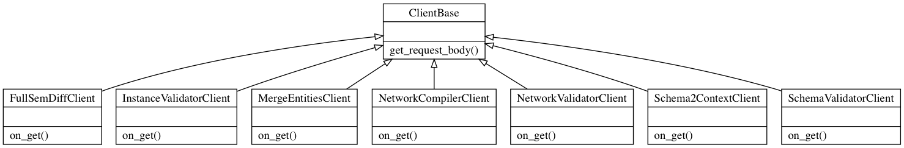
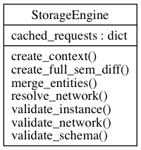

=============================================
API client: code documentation
=============================================

The JSONLDschema package offers and API client that provides most of the library functionality through a RESTFul service.

Here we include the documentation of each of the Python classes and properties for the API client.

API client
-------------------------------------------

.. automodule:: client
    :members:
    :noindex:

API utilities
-------------------------------------------

.. automodule:: utility
    :members:
