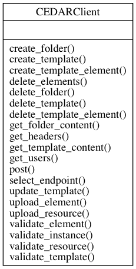
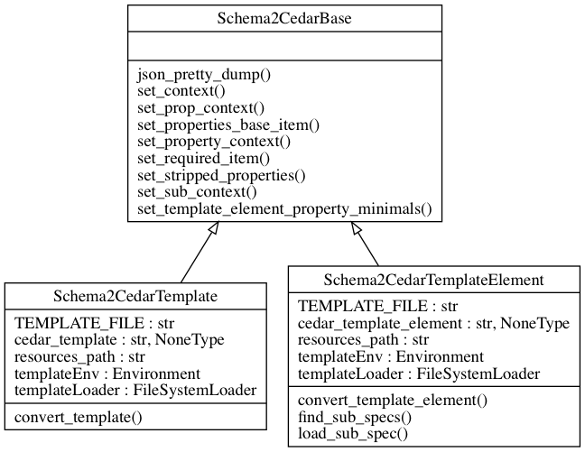

=============================================
Code documentation for the CEDAR utilities
=============================================

The CEDAR client provides all the links the the CEDAR API functionality such as GET, POST and updates on templates,
template elements, folders, instances, and so on.

.. automodule:: client
    :members:

---------------

The schema2cedar classes will help you transform your JSON schemas draft-04 into compatible CEDAR schemas, which can be visualised on the CEDAR Workbench tool.

.. automodule:: schema2cedar
    :members:

