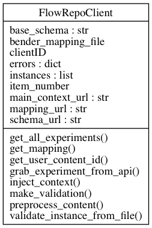

==========================================================
How to validate JSON-schemas and instances: code documentation
==========================================================

.. automodule:: jsonschema_validator
    :members:

.. automodule:: miflowcyt_validate
    :members:

.. autoclass:: FlowRepoClient
    :members:
